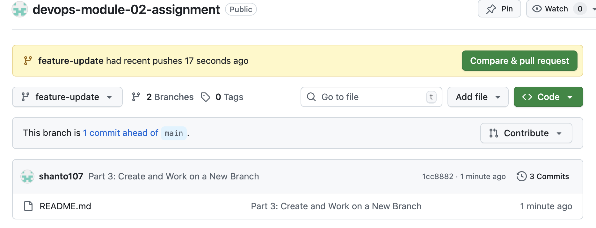
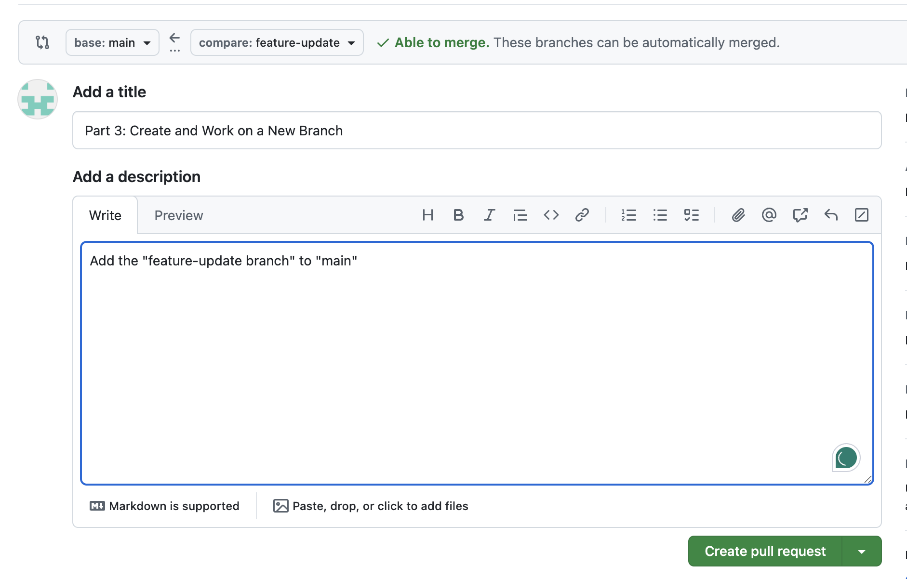
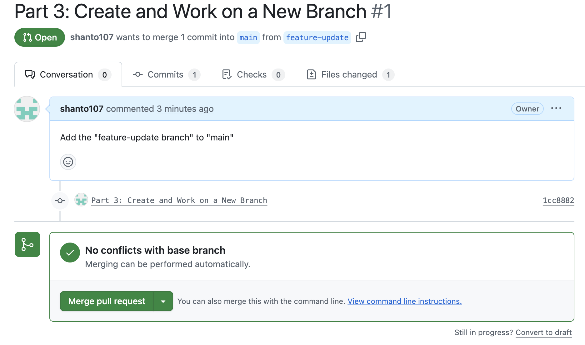
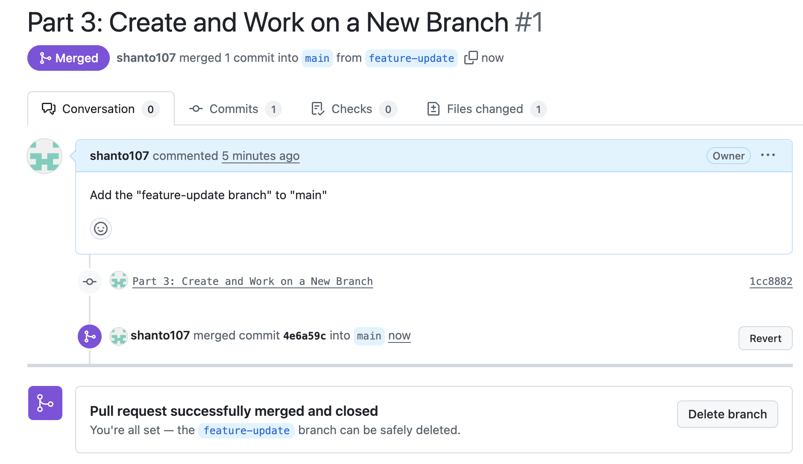

# **Part 1: Set Up a Local Git Repository**
    => Created a local folder named "Module-02-Assignment" 
        => created README.md 
            => git init -> git add . -> git commit 
    
# **Part 2: Create and Connect a GitHub Repository**
    =>Created GitHub remote repository named "devops-module-02-assignment"
        => git init -> git add . -> git commit 
            => git branch -M main -> git remote add origin -> git push -u origin main

# **Part 3: Create and Work on a New Branch**
    => git branch feature-update -> git switch feature-update    
        => picture added in the 'feature-update' branch
    
# **Part 4: Push the Branch and Create a Pull Request**

    
    

# **Part 5: Merge and Update Local Repository**

    
    

